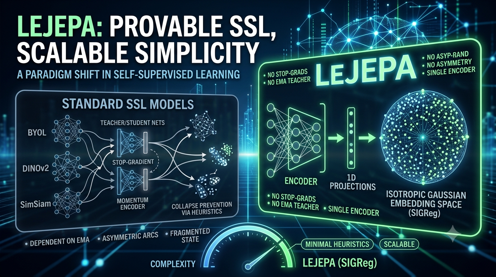

# Benchmarking Modern Self-Supervised Learning Methods for Image Representation Learning

<p align="center">
  
</p>

<p align="center">


</p>

---

# Overview

This repository contains the implementation developed for the MSc Individual Research Project at **Coventry University**.

> **Benchmarking Modern Self-Supervised Learning Methods for Image Representation Learning: A Comparative Study of LeJEPA, SimCLR, BYOL, VICReg, and Barlow Twins**

The project provides a unified benchmarking framework for evaluating modern Self-Supervised Learning (SSL) methods under identical experimental conditions.

Unlike many published comparisons, every model uses:

- Common ResNet-18 backbone
- Identical datasets
- Same augmentations
- Same optimizer
- Same evaluation pipeline
- Common Linear Probe protocol

This ensures a fair comparison between different SSL objectives.

---

# Implemented SSL Methods

| Method | Paradigm |
|---------|-----------|
| SimCLR | Contrastive Learning |
| BYOL | Bootstrap Self-Supervision |
| VICReg | Variance-Invariance-Covariance Regularization |
| Barlow Twins | Redundancy Reduction |
| LeJEPA | Joint Embedding Predictive Architecture |

---

# Datasets

Supported datasets

- CIFAR-10
- STL-10

---

# Repository Structure

```text
ssl-benchmark/

configs/
datasets/
checkpoints/
logs/
results/

models/
    backbone/
    heads/
    losses/
    methods/

engine/
scripts/
utils/

requirements.txt
README.md
```

---

# Installation

Clone repository

```bash
git clone https://github.com/saif-nizami/lejepa-comparison-framework.git
cd ssl-benchmark
```

Create virtual environment

```bash
python3.11 -m venv .venv
```

Activate

macOS / Linux

```bash
source .venv/bin/activate
```

Windows

```powershell
.venv\Scripts\activate
```

Install dependencies

```bash
pip install --upgrade pip
pip install -r requirements.txt
```

---


# Project Workflow

```text
Download Dataset
        │
        ▼
SSL Pretraining
        │
        ▼
Linear Probe Evaluation
        │
        ▼
Performance Metrics
        │
        ▼
t-SNE / UMAP
        │
        ▼
Automatic Report Generation
```

---

# Training

Train any SSL model

```bash
python scripts.train.py --model simclr --dataset cifar10
```

Available models

```text
simclr
byol
vicreg
barlow_twins
lejepa
```

Available datasets

```text
cifar10
stl10
```


# Linear Probe Evaluation

Run downstream evaluation

```bash
python scripts.linear_probe --model simclr --dataset cifar10
```

Example

```bash
python scripts.linear_probe --model lejepa --dataset stl10
```

---

# Generate Reports

Generate benchmark summaries and plots

```bash
python scripts.generate_comparison --dataset cifar10
```


---


# Pipeline

- Train SSL model
- Save checkpoints
- Linear Probe evaluation
- Generate metrics
- Create confusion matrices
- Generate t-SNE
- Generate UMAP
- Export figures
- Export reports

---

# Results

Results are automatically saved inside

```text
results/

tables/
figures/
embeddings/
confusion_matrices/
reports/
logs/
```

---

# Evaluation Metrics

The framework evaluates each model using

- Linear Probe Accuracy
- Precision
- Recall
- F1-score
- Confusion Matrix
- t-SNE
- UMAP
- Representation Quality
- Training Loss
- Validation Loss

---

---

# Future Improvements

Potential extensions include

- Vision Transformers (ViT)
- DINOv2
- MAE
- ImageNet
- Multi-GPU training
- Mixed Precision
- Distributed Training
- Additional SSL algorithms

---

# Citation

```bibtex
@mastersthesis{nizami2026,
  author  = {Saif Nizami},
  title   = {Benchmarking Modern Self-Supervised Learning Methods for Image Representation Learning: A Comparative Study of LeJEPA, SimCLR, BYOL, VICReg, and Barlow Twins},
  school  = {Coventry University},
  year    = {2026}
}
```

---

# Acknowledgements

This project builds upon the pioneering work of the original authors of

- SimCLR
- BYOL
- VICReg
- Barlow Twins
- LeJEPA

Their contributions to Self-Supervised Learning are gratefully acknowledged.

---

# License

Released under the MIT License.